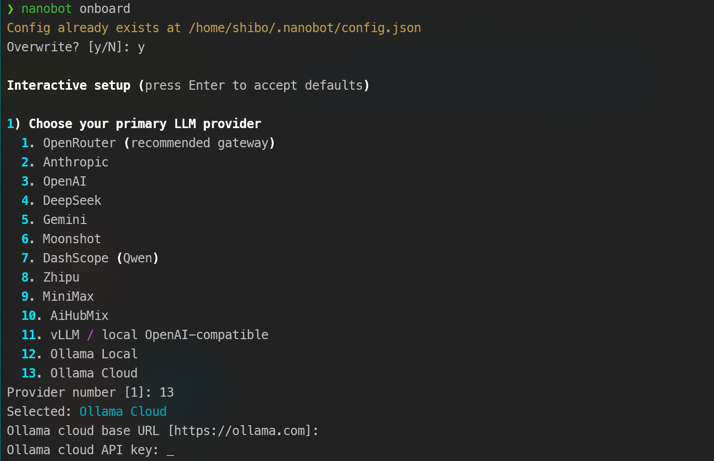
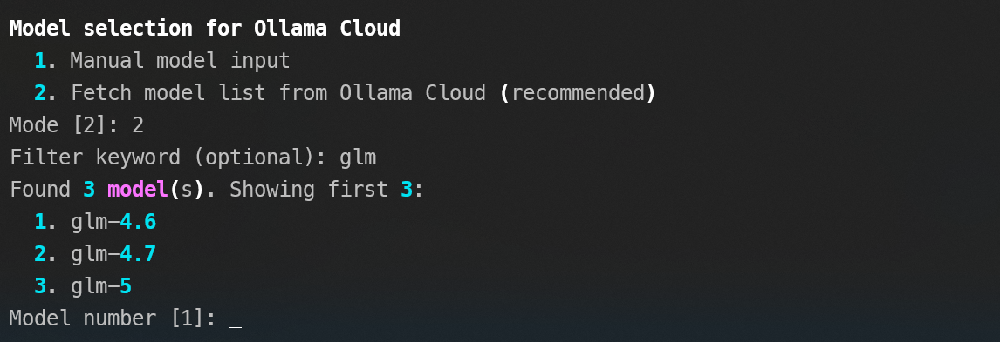
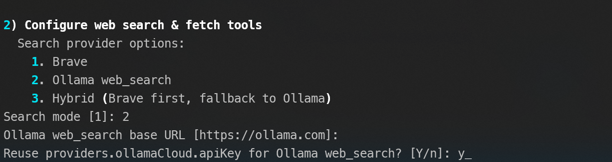

# FeatherFlow Assistant

FeatherFlow is a lightweight personal AI assistant runtime focused on practical automation, conversational workflows, and extensibility.

## Project Origin

This project idea is derived from `nanobot` upstream `origin/main` at commit `30361c9307f9014f49530d80abd5717bc97f554a` (2026-02-23), then evolved for a Feishu-first domain workflow.

## What FeatherFlow Provides

- Feishu-first chat runtime for production usage
- Multi-provider LLM routing (OpenRouter, OpenAI, Anthropic, DeepSeek, Gemini, local OpenAI-compatible endpoints, etc.)
- Built-in tools for files, shell, web search/fetch, scheduling, and sub-agents
- RAM-first memory with snapshots, lessons, and compact session history
- MCP integration for external tool servers
- Complete CLI workflow for onboarding, chat, gateway, status, memory, and cron management

## Screenshot: Onboarding Menu

The onboarding flow is interactive and supports provider/model selection, key setup, web mode selection, and identity setup.





## Core Capabilities

### 1. Interactive Onboarding

`featherflow onboard` guides you through:

- LLM provider selection
- model selection (including cloud model listing for compatible providers)
- API key and base URL setup
- web search/fetch mode setup
- runtime identity and soul preset setup

### 2. Chat and Gateway Modes

- `featherflow agent`: interactive terminal chat
- `featherflow agent -m "..."`: one-shot prompt
- `featherflow gateway`: long-running gateway for channels and scheduled jobs

### 3. Feishu Runtime

- WebSocket long connection
- access control via `allowFrom`
- gateway routing and progress streaming controls

### 4. Memory and Self-Improvement

- session memory with unconsolidated window handling
- long-term snapshots and audit trails
- lesson extraction from user feedback and tool outcomes
- configurable confidence and promotion logic

### 5. Scheduled Tasks

- interval jobs
- cron-expression jobs
- one-time jobs
- manual run / enable / disable / remove

### 6. MCP Support

Connect MCP servers and expose external tools directly to FeatherFlow.

## Installation

### Prerequisites

- Python 3.11+
- Linux/macOS shell environment recommended

### From Source

```bash
git clone <your-fork-url>
cd <repo-dir>
python3 -m venv .venv
source .venv/bin/activate
pip install -e '.[dev]'
```

## Quick Start

```bash
featherflow onboard
featherflow agent -m "hello"
featherflow gateway
featherflow status
```

## Configuration Overview

Main config is JSON-based and includes:

- `providers`: API keys and endpoints
- `agents.defaults`: model, temperature, limits, identity defaults
- `channels.feishu`: app credentials and allow-list
- `tools`: web/search/fetch/exec behavior and MCP servers
- `heartbeat`: periodic background prompts

Example skeleton:

```json
{
  "providers": {
    "openrouter": {
      "apiKey": "sk-or-v1-xxx"
    }
  },
  "agents": {
    "defaults": {
      "model": "anthropic/claude-opus-4-5",
      "name": "featherflow"
    }
  },
  "channels": {
    "feishu": {
      "enabled": true,
      "appId": "cli_xxx",
      "appSecret": "xxx",
      "allowFrom": []
    }
  }
}
```

## CLI Reference

- `featherflow onboard`
- `featherflow agent`
- `featherflow gateway`
- `featherflow status`
- `featherflow channels status`
- `featherflow memory status`
- `featherflow cron add|list|run|remove|enable`
- `featherflow provider login <provider>`

## Development

### Run Tests

```bash
PYTHONPATH=. .venv/bin/pytest -q
```

### Lint

```bash
.venv/bin/ruff check .
```

## Notes

- The repository keeps a compact implementation style for fast iteration.
- Use dedicated keys and strict channel allow-lists for production.
- Read `docs/SECURITY.md` before internet-facing deployment.

## License

MIT
